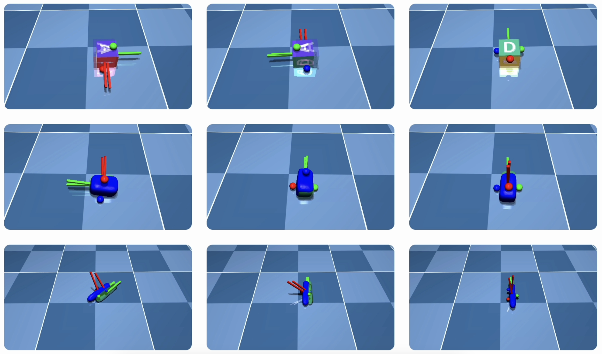
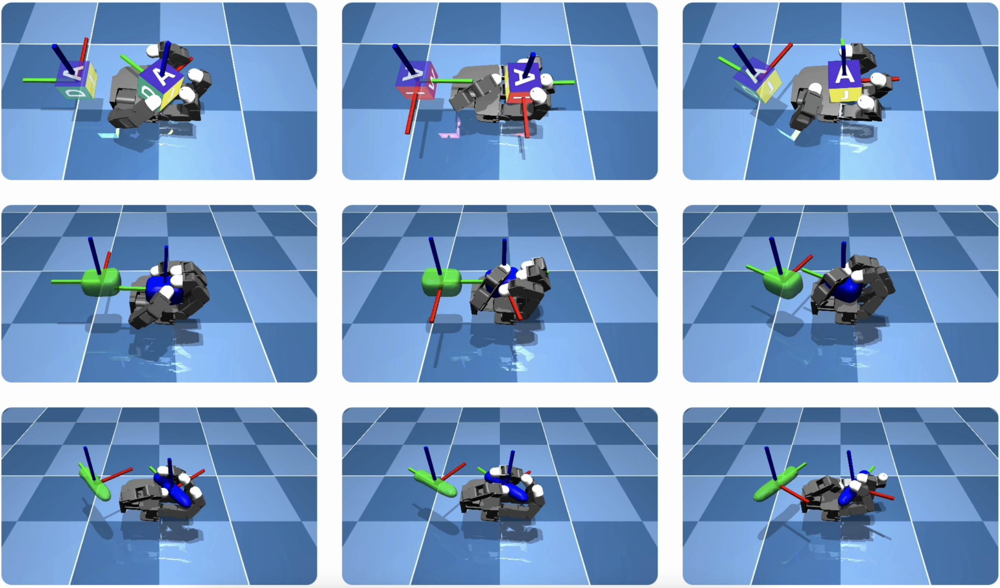

# ContactSDF: Signed Distance Functions as Multi-Contact Models for Dexterous Manipulation

**Overview:**  ContactSDF is an method model that uses signed distance functions (SDFs) to approximate multi-contact model, including both collision detection and time-stepping routines. ContactSDF achieves a closed-form state prediction and end-to-end differentiability, enabling efficient model learning and optimization for contact-rich manipulation. 

Check the [[Preprint]](https://arxiv.org/abs/2408.09612), [[Website]](https://yangwen-1102.github.io/contactsdf.github.io/), [[Youtube video]](https://www.youtube.com/watch?v=2AsMYCT-jQI&t=2s) for more information.





# Prerequisites

1. Casadi 3.6.5

   ```shell
   pip install casadi==3.6.5
   ```
2. Mujoco 3.1.6

   ```shell
   pip install mujoco==3.1.6
   ```

This repo has been tested with the dependencies from the above version in a Ubuntu 20.04 system, other package version should also work.

# Manipulation with ContactSDF

Directly run the manipulation test with the pre-trained ContactSDF model on the three-ball case and the Allegro hand case. Each case contains three objects, cube, foambrick and stick). Use the following script to run the manipulation, for example in Linux, go to the root directory of the project and run the following command:

**Three-ball manipulation**

```shell
python3 test_cube.py
```

**Allegro on-palm manipulation**

```shell
python3 test_allegro_stick.py
```

Switch to other objects by replacing the object name in the script.

# Learning from scratch

You can also learn the ContactSDF model from scratch, use the following command to test:

```shell
python3 learning/cases/cube/learn.py
```

Switch to other objects by replacing the object name in the script.

# Contact

For questions, please contact Wen Yang (wenyang@asu.edu)

# Citation

If you find ContactSDF or this code repo helpful in your work, please consider citing:

```
@article{yang2024contactsdf,
  title={ContactSDF: Signed Distance Functions as Multi-Contact Models for Dexterous Manipulation},
  author={Yang, Wen and Jin, Wanxin},
  journal={arXiv preprint arXiv:2408.09612},
  year={2024}
}
```
